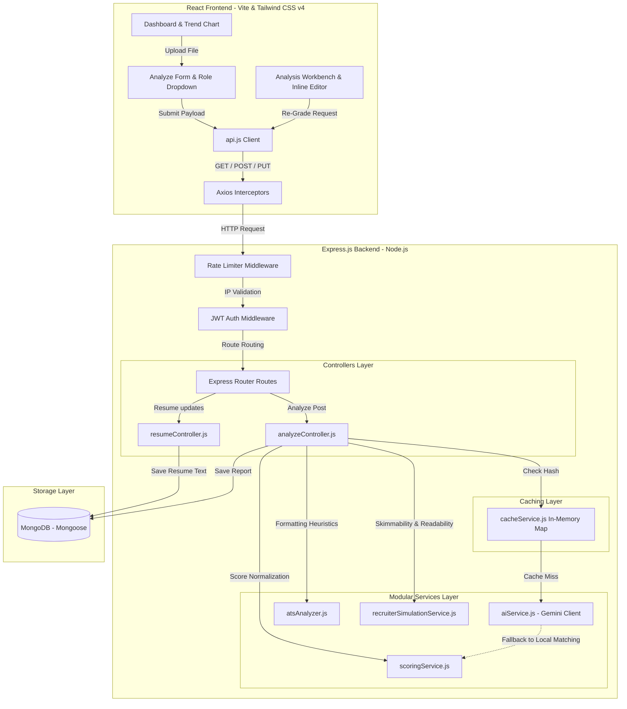

# AI-Powered Resume Grader (MERN Stack)

An advanced Applicant Tracking System (ATS) optimization tool that parses resumes, analyzes keyword density, evaluates section structure, rewrites bullet points, and provides side-by-side comparison trends using Gemini AI. It features a recruiter visual check simulator, parser layout checklist, real-time content workbench, and draft comparisons.

---

## 🏗️ System Architecture

The application is built on a clean MERN stack architecture with a modular services layer, in-memory caching, and global rate limiting.

### System Architecture Flowchart


---

## 🚀 Premium Feature Enhancements

1. **Recruiter Scan Simulation Mode**: Estimates visual skimmability (bullet balance, spacing) and readability grade (Flesch-Kincaid heuristic), lists top visual hotspots, and flags warning signals (unquantified achievements, text walls).
2. **ATS Parser Compatibility Checklist**: Scans raw document layouts to flag parsing obstacles (special characters, tab layouts, pipe dividers, complex grids) and recommends step-by-step formatting fixes.
3. **Job Match Probability Engine**: Replaces basic scoring with a calculated percentage chance of being shortlisted by hiring managers, weighing keyword matching (40%), experience duration (30%), and structural formatting (30%).
4. **Interactive Section Heatmaps**: Color-coded visualization of individual section strengths (Summary, Experience, Skills, Education) to help focus on weak bullet points.
5. **Real-Time Workbench Editor**: Users can edit their parsed resume text inline, save changes directly to MongoDB, and click "Save & Re-Grade" to trigger a fresh evaluation in seconds.
6. **Double-Draft Comparison**: Compare two report versions side-by-side to review score deltas, shortlist probability gains, readability/skimmability improvement graphs, and resolved skills gaps.
7. **Rate Limiting & Caching**: Custom in-memory rate-limiter guards endpoints from abuse, while a hashed Map caching layer skips redundant AI calls for identical resume-role inputs.

---

## 🛠️ Project Layout

```
AI_RESUME_GRADER/
├── Backend/          # Node.js + Express + Mongoose (MVC architecture)
│   ├── api/          # Express route registration API endpoints
│   ├── config/       # Databases & Third-Party Configuration (Cloudinary)
│   ├── controllers/  # Route handlers (auth, resume, jd, analysis)
│   ├── middlewares/  # JWT authentication, Rate limiting & Error handlers
│   ├── models/       # Mongoose schemas (User, Resume, JobDescription, Analysis)
│   ├── services/     # Modular business services (ai, scoring, ats, recruiter)
│   └── uploads/      # Development local uploads folder
└── Frontend/         # React.js (Vite compiler) + Tailwind CSS v4
    ├── src/
    │   ├── components/ # ScoreCard, SuggestionsPanel, ResumeViewer workbench
    │   ├── pages/      # Login, Dashboard, Analyze, Compare profiles
    │   ├── services/   # Axios endpoint mappings (api.js)
    │   ├── store/      # React AuthContext state provider
    │   └── index.css   # Tailwind v4 theme specifications & glass styles
    └── dist/           # Built static assets folder
```

---

## ⚙️ Quick Start

### Prerequisites
- Node.js installed
- MongoDB installed and running locally on `mongodb://localhost:27017`

### Step 1: Start the Backend Server
1. Navigate to the `Backend` directory:
   ```bash
   cd Backend
   ```
2. Install dependencies:
   ```bash
   npm install
   ```
3. Set up environment variables in a `.env` file (refer to `Backend/.env` for local details):
   ```env
   PORT=5000
   MONGO_URI=mongodb://localhost:27017/resume_grader
   JWT_SECRET=your_secret_key
   GEMINI_API_KEY=your_gemini_api_studio_key
   ```
4. Run the server in development mode:
   ```bash
   npm run start
   ```
   *Note: On boot, the server will auto-seed the demo account `demo@resumegrader.com` with password `password123`.*

### Step 2: Start the Frontend Application
1. Navigate to the `Frontend` directory:
   ```bash
   cd ../Frontend
   ```
2. Install dependencies:
   ```bash
   npm install
   ```
3. Launch the Vite development server:
   ```bash
   npm run dev
   ```
4. Open the browser link printed in the terminal (usually `http://localhost:5173`).
5. Click **"Use Demo Credentials"** on the Login screen to log in immediately and explore the tool!
